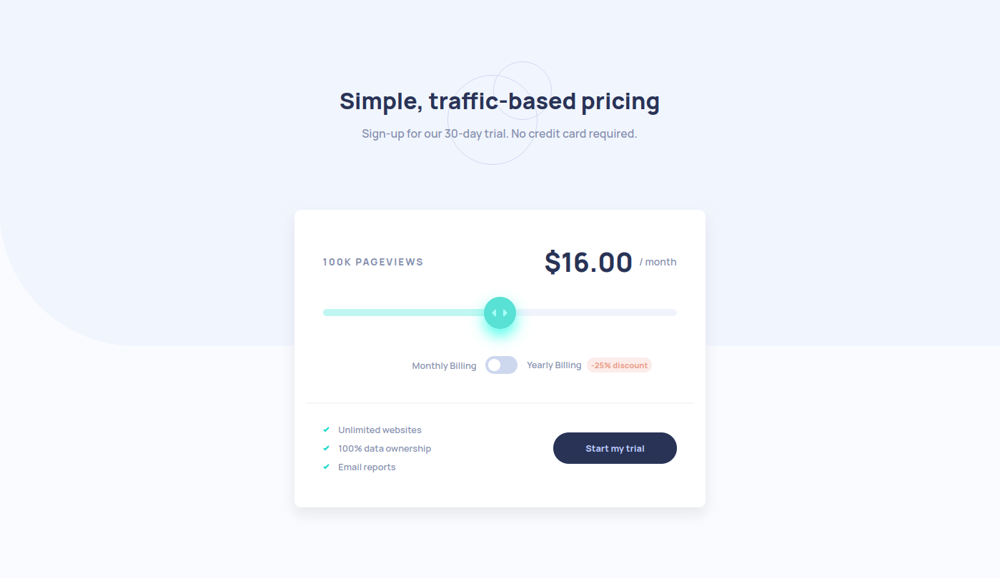

# Frontend Mentor - Interactive pricing component solution

This is a solution to the [Interactive pricing component challenge on Frontend Mentor](https://www.frontendmentor.io/challenges/interactive-pricing-component-t0m8PIyY8). Frontend Mentor challenges help you improve your coding skills by building realistic projects.

## Table of contents

- [Overview](#overview)
  - [The challenge](#the-challenge)
  - [Screenshot](#screenshot)
  - [Links](#links)
- [My process](#my-process)
  - [Built with](#built-with)
  - [What I learned](#what-i-learned)
  - [Useful resources](#useful-resources)
- [Author](#author)

## Overview

### The challenge

Users should be able to:

- View the optimal layout for the app depending on their device's screen size
- See hover states for all interactive elements on the page
- Use the slider and toggle to see prices for different page view numbers

### Screenshot

### Links

- Solution URL: [My Solution](https://your-solution-url.com)
- Live Site URL: [Live](https://matiasbastarrica.github.io/interactive-pricing-component/)

## My process

### Built with

- Semantic HTML5 markup
- CSS custom properties
- Flexbox
- CSS Grid
- Mobile-first workflow
- JavaScript

### What I learned

I learned to write and style a slider and display different billing date based on the value of the slider using JavaScript.

### Useful resources

- [How To - Range Slider](https://www.w3schools.com/howto/howto_js_rangeslider.asp) - This helped me write and style the range slider. I really liked this pattern and will use it going forward.
- [How To -Toggle Switch](https://www.w3schools.com/howto/howto_css_switch.asp) - This is an amazing article which helped me finally understand how to deal with a toggle switch. I'd recommend it to anyone still learning this concept.

## Author

- Frontend Mentor - [@MatiasBastarrica](https://www.frontendmentor.io/profile/MatiasBastarrica)
